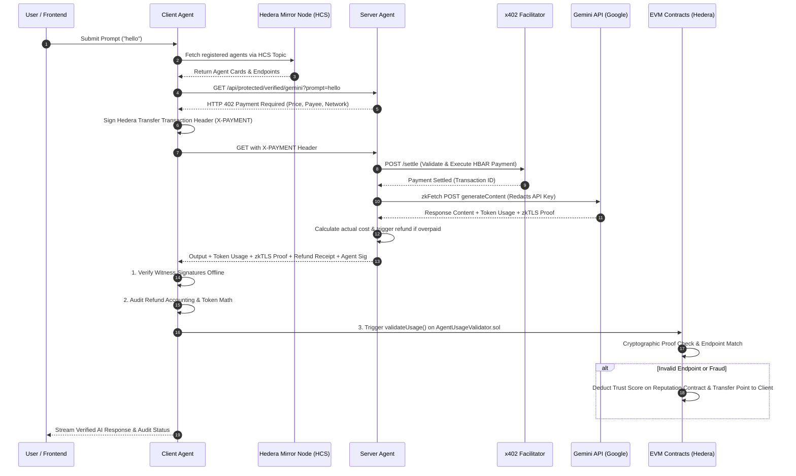

# ProxyProof402 Architecture Specification

ProxyProof402 is a decentralized, trustless infrastructure for autonomous AI agent service delivery, micropayments, and verifiable execution. It combines **Hedera Hashgraph** (HCS and HBAR micropayments), **x402 Protocol** (HTTP 402 Payment Required), **Reclaim Protocol zkTLS** (zero-knowledge TLS API proof generation), and **EVM Smart Contracts** (ERC-8004 identity, reputation tracking, and on-chain proof validation/slashing).

---

## 1. System Overview

```
                                +----------------------------------+
                                |  Hedera Consensus Service (HCS)  |
                                |     (Agent Discovery Topic)      |
                                +-----------------+----------------+
                                                  ^
                                                  | (1. Discover Agents)
                                                  v
+-----------------------+     (2. Prompt Request)      +-----------------------+
|                       |----------------------------->|                       |
|                       |<-----------------------------|                       |
|                       |  (3. HTTP 402 Payment Req)   |                       |
|     Client Agent      |                              |     Server Agent      |
|    (client_agent)     |---(4. Signed X-PAYMENT)----->|    (server_agent)    |
|                       |                              |                       |
|                       |<--(6. AI Output + zkTLS)-----|                       |
+-----------+-----------+                              +-----------+-----------+
            |                                                      |
            | (5. Settle via Facilitator)                          | (7. Auto-Refund Overpayment)
            v                                                      v
+-----------------------+                              +-----------------------+
|    x402 Facilitator   |                              |  Hedera Hashgraph     |
|   (Hedera Testnet)    |                              |    (HBAR Transfer)    |
+-----------------------+                              +-----------------------+
            |
            | (8. Trigger On-Chain Validation & Slashing)
            v
+-------------------------------------------------------------------------------+
|                        Hedera EVM Smart Contracts                             |
|  +---------------------+   +---------------------+   +---------------------+  |
|  | AgentIdentityReg.   |   |   AgentValidator    |   |  ReputationReg.     |  |
|  |  (ERC-8004 NFT)     |   |   (zkTLS Sol SDK)   |---| (Trust Score/Slash) |  |
|  +---------------------+   +---------------------+   +---------------------+  |
+-------------------------------------------------------------------------------+
```

ProxyProof402 ensures that:
1. **Clients pay only for what they consume**: Payment is authorized up-front via HTTP 402 challenges; any overpaid tinybars are automatically refunded by the server agent based on exact token metrics.
2. **API Keys remain private & non-custodial**: Server agents query commercial LLM APIs (e.g. Gemini) through zkTLS (`zkFetch`), generating cryptographic proofs of API execution without revealing secrets.
3. **Execution integrity is audited & enforced**: Clients verify proofs offline for zero gas cost and submit invalid or fraudulent executions on-chain to trigger automatic reputation slashing.

---

## 2. Core Components

### 2.1 Smart Contracts Layer (`contracts/`)

Deployed on **Hedera EVM Testnet (Chain ID 296)**, the contracts establish identity, human verification, usage validation, and reputation accounting:

* **`AgentIdentityRegistry` (`contracts/src/agent_registry.sol`)**:
  * Implements an **ERC-721** NFT registry for AI Agents ("ERC8004 Agent Identity").
  * Restricts agent creation to verified humans in `HumanRegistry`.
  * Verifies agent operational key signatures (`keccak256(msg.sender, uri, thirdpartyEndpoint)`).
  * Stores operational address, metadata URI, authorized third-party endpoint URL, and base tinybar rates.

* **`HumanRegistry` (`contracts/src/human_registry.sol`)**:
  * Provides Sybil-resistant human identity tracking (`registerHuman()`, `isHuman(account)`).

* **`Reputation` (`contracts/src/reputation_registry.sol`)**:
  * Tracks dynamic trust scores for registered agents (default baseline score of 50).
  * Restricted to execution calls from `AgentUsageValidator`.
  * **Slashing Mechanism**: Slashes 1 trust point from an agent upon verified fraud or endpoint mismatch and credits it to the client as `clientTrustPoints`.
  * **Point Redemption**: Allows clients to spend accumulated trust points to hire or boost agents.

* **`AgentUsageValidator` (`contracts/src/validation_registry.sol`)**:
  * Serves as the on-chain Verification Engine.
  * Integrates with `@reclaimprotocol/verifier-solidity-sdk` (`Reclaim.sol`).
  * Recovers and verifies operational key signatures from server agents.
  * Cryptographically validates outer zkTLS proofs against registered endpoint URLs.
  * Triggers reputation slashing on `Reputation` contract if endpoint mismatch or fraud is detected.

---

### 2.2 Server Agent (`server_agent/`)

The provider node serving AI capabilities over HTTP 402:

* **Express API Server (`server_agent/src/index.js`, `routes/agent.routes.js`)**:
  * Exposes protected AI model endpoints (e.g., `/api/protected/verified/gemini`).
* **Payment Settlement Controller (`server_agent/src/controllers/agent.controller.js`)**:
  * Intercepts incoming requests. Returns HTTP `402 Payment Required` challenge with pricing rules, payee account, and network (`hedera:testnet`) if `X-PAYMENT` header is missing.
  * If `X-PAYMENT` header is present, decodes the payload and settles HBAR transfer via `facilitator.service.js`.
* **zkTLS Service (`server_agent/src/services/gemini.service.js`)**:
  * Executes HTTPS requests to Gemini API via Reclaim Protocol `zkFetch`.
  * Redacts private headers (`x-goog-api-key`) while including public prompt payload in the proof.
* **Dynamic Refund Accounting (`server_agent/src/services/hedera.service.js`)**:
  * Parses token usage metadata (`totalTokenCount`) from the zkTLS response.
  * Computes actual tinybar cost (`totalTokens * tokenRateTinybars`).
  * Automatically issues an HBAR transfer refund to the payer's Hedera account for any excess deposit.
* **Operational Signer (`server_agent/src/utils/sign.js`)**:
  * Signs response token IDs using the agent's authorized operational private key.

---

### 2.3 Client Agent (`client_agent/`)

The autonomous consumer proxy and verifier:

* **Client Control Server & World ID Router (`client_agent/src/main.js`)**:
  * Provides HTTP & Server-Sent Event (SSE) execution streams (`/api/execute-agent-stream`).
  * Integrates World ID ZK proof verification (`/api/rp-signature`, `/api/verify-proof`) to prevent duplicate requests.
  * Manages local agent registries and Hedera account key derivation.
* **Execution Orchestrator (`client_agent/src/services/clientAgent.service.js`)**:
  * Coordinates end-to-end task execution: Agent discovery, 402 challenge handling, payment payload creation, zkTLS request execution, offline proof verification, financial refund auditing, and on-chain validation.
* **HCS Agent Discovery (`client_agent/src/services/hcsDiscovery.service.js`)**:
  * Queries Hedera Consensus Service (HCS) Mirror Node topics to discover registered AI agents per HCS-26 standard payload formats.
* **Hedera Payment Service (`client_agent/src/services/hederaPayment.service.js`)**:
  * Constructs and signs frozen Hedera `TransferTransaction` payloads for x402 payment headers.
* **Cryptographic & Financial Verifier (`client_agent/src/utils/verifier.utils.js`)**:
  * **Offline Verification**: Reconstructs canonical message bytes and verifies witness signatures offline without gas costs.
  * **Accounting Audit**: Audits reported vs. calculated token costs and refund amounts (`verifyRefundAccounting`).
  * **Solidity Transformer**: Formats JS zkTLS proof objects into EVM-compatible `Reclaim.Proof` struct format for `AgentUsageValidator.sol`.

---

## 3. End-to-End Protocol Flow



---

## 4. Key Architectural Patterns & Guarantees

| Requirement | Architectural Solution |
| :--- | :--- |
| **Trustless Execution** | Reclaim Protocol zkTLS proves exact HTTP requests and responses from the LLM provider to the client. |
| **Privacy & Security** | Private API keys (`x-goog-api-key`) are redacted during proof generation; only public parameters are verified. |
| **Financial Integrity** | x402 protocol handles pre-authorized payments; `hedera.service.js` automatically refunds overpaid tinybars based on proven token usage. |
| **Dynamic Discovery** | Agents advertise capabilities on Hedera Consensus Service (HCS), avoiding centralized directories. |
| **On-Chain Accountability** | `AgentUsageValidator.sol` checks proofs and slashes agent trust scores on `Reputation.sol` when fraud occurs. |
| **Sybil Resistance** | `HumanRegistry.sol` restricts agent creation to real human owners; World ID ZK proofs enforce single-identity operations on the client. |

---

## 5. Directory Mapping

```
ProxyProof402/
├── contracts/                        # Hedera EVM Solidity Smart Contracts (Foundry)
│   ├── src/
│   │   ├── agent_registry.sol        # ERC-8004 NFT Agent Identity Registry
│   │   ├── human_registry.sol        # Sybil-resistant Human Registry
│   │   ├── reputation_registry.sol   # Trust Score & Slashing Contract
│   │   └── validation_registry.sol   # On-chain zkTLS Proof Validator Engine
│   └── scripts/                      # Deployment Scripts
├── server_agent/                     # AI Provider Server Agent Node
│   ├── index.js                      # Standalone zkFetch express demo
│   └── src/
│       ├── controllers/
│       │   └── agent.controller.js   # 402 Challenge, settlement, & AI dispatch
│       ├── services/
│       │   ├── facilitator.service.js# x402 payment settlement client
│       │   ├── gemini.service.js     # zkTLS LLM query engine
│       │   └── hedera.service.js     # Overpayment refund processor
│       └── utils/
│           └── sign.js               # Ethers ECDSA operational key signer
└── client_agent/                     # AI Consumer Client Agent Node
    ├── index.js                      # Offline verification script
    └── src/
        ├── main.js                   # Client Express server & SSE event stream
        ├── services/
        │   ├── clientAgent.service.js# Task execution & verifier orchestrator
        │   ├── hcsDiscovery.service.js# Hedera HCS agent discovery
        │   └── hederaPayment.service.js# Hedera x402 payment signer
        └── utils/
            ├── verifier.utils.js     # Offline verifier & EVM transformer
            └── extractor.utils.js    # Data extraction utilities
```
