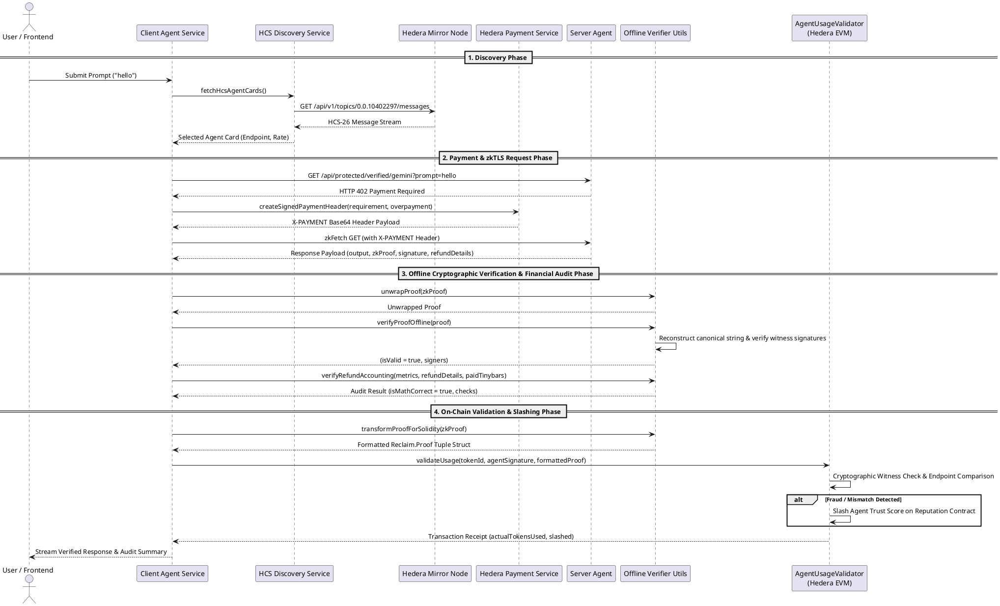

# Client Agent Architecture & Interaction Specification

The **Client Agent** (`client_agent/`) acts as an autonomous proxy and execution verifier on behalf of end users. It discovers active AI agents via Hedera Consensus Service (HCS), creates signed x402 payment headers, executes zkTLS API requests, verifies witness signatures offline, audits financial refund math, and triggers on-chain validation & slashing on Hedera EVM smart contracts.

---

## Core Client Agent Responsibilities

### 1. Dynamic Agent Discovery (`hcsDiscovery.service.js`)
- Queries Hedera Mirror Node topics (`0.0.10402297`) for agent registration messages adhering to the HCS-26 standard.
- Parses agent metadata, operational status, rates, and endpoint URIs to select the optimal agent for a prompt.

### 2. Autonomous Micropayment Authorization (`hederaPayment.service.js`)
- Catches HTTP `402 Payment Required` responses from server agents.
- Constructs frozen Hedera `TransferTransaction` payloads signed with operator credentials.
- Base64 encodes transaction payloads into `X-PAYMENT` headers (supporting overpayment simulations for testing refund logic).

### 3. Offline Witness Verification (`verifier.utils.js`)
- Unwraps nested proof objects (`unwrapProof`).
- Reconstructs canonical claim byte strings from claim metadata.
- Recovers witness addresses offline using Ethers.js ECDSA message verification without incurring gas costs.

### 4. Financial Refund Accounting Audit (`verifier.utils.js`)
- Extracts `totalTokenCount` from HTTP body buffers contained within the zkTLS proof.
- Verifies that:
  $$\text{Expected Actual Cost} = \text{totalTokens} \times \text{tokenRateTinybars}$$
- Verifies reported vs expected refund amounts and transaction status.

### 5. On-Chain Validation & Slashing Interactivity (`verifier.utils.js`)
- Transforms JavaScript zkTLS proof objects into Solidity-compatible `Reclaim.Proof` struct format (`transformProofForSolidity`).
- Invokes `validateUsage(tokenId, agentSignature, proof)` on `AgentUsageValidator.sol` on Hedera EVM testnet.
- Triggers automatic trust score slashing on `Reputation.sol` if endpoint tampering or fraudulent execution is detected.

---

## PlantUML Client Interaction Diagram

