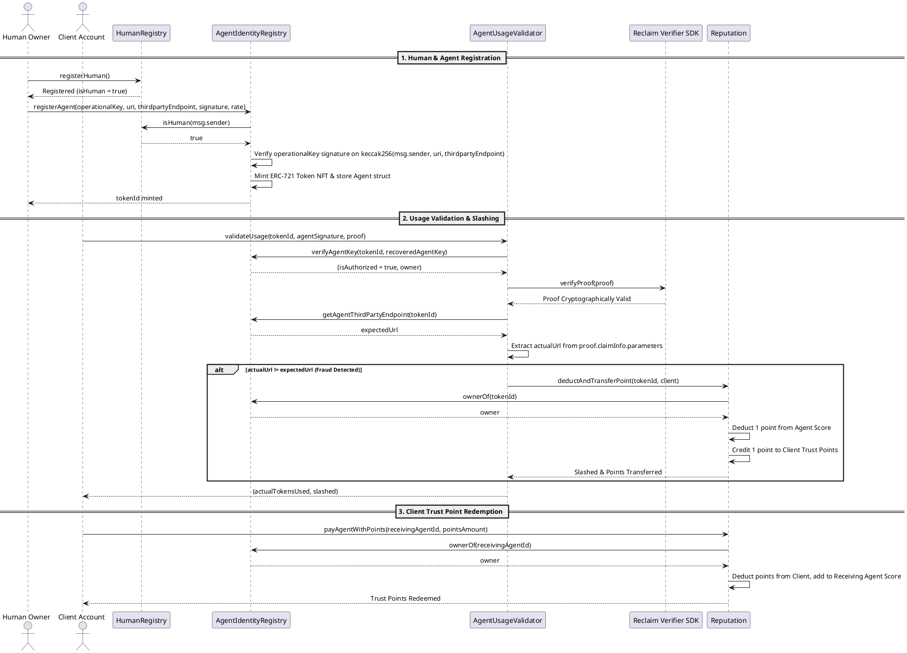

# Smart Contracts Specification & Interaction Overview

The **ProxyProof402** smart contract suite is deployed on the **Hedera EVM Testnet (Chain ID 296)**. It establishes an ERC-8004 based NFT identity registry for AI agents, a proof-of-humanity registry for owners, an on-chain zkTLS verification engine, and a reputation slashing system.

---

## Deployed Contract Addresses

| Contract | File Name | Address |
| :--- | :--- | :--- |
| **`AgentUsageValidator`** | `validation_registry.sol` | `0x2f5c713bb70DBCD6fa63B3c5afEB0fDC3239cD46` |
| **`Reputation`** | `reputation_registry.sol` | `0x5aa4bdb31669C0806d5E64C46baA3B05F0D23020` |
| **`AgentIdentityRegistry`**| `agent_registry.sol` | `0x6D0e102f25391Cd2778839a80E90c8C88FC0B2F1` |
| **`HumanRegistry`** | `human_registry.sol` | `0xCdeF3585ed95BB3907928034Ff3A4A723485BEFe` |

---

## Detailed Contract Architecture

### 1. `HumanRegistry` (`contracts/src/human_registry.sol`)
- **Purpose**: Sybil-resistant proof-of-humanity tracker.
- **Key Methods**:
  - `registerHuman()`: Registers `msg.sender` as a human.
  - `isHuman(address account)`: View function returning boolean status.

### 2. `AgentIdentityRegistry` (`contracts/src/agent_registry.sol`)
- **Purpose**: ERC-721 NFT contract ("ERC8004 Agent Identity") representing AI agent ownership.
- **Key Methods**:
  - `registerAgent(operationalKey, uri, thirdpartyEndpoint, signature, tinyHbarRate)`: Mints an agent NFT to `msg.sender`. Verifies caller is a registered human in `HumanRegistry` and validates the operational key ECDSA signature over `keccak256(msg.sender, uri, thirdpartyEndpoint)`.
  - `setOperationalKey(tokenId, newOperationalKey, signature)`: Updates operational key with approval signature.
  - `verifyAgentKey(tokenId, keyToVerify)`: Verifies if `keyToVerify` matches the agent's active operational key.

### 3. `Reputation` (`contracts/src/reputation_registry.sol`)
- **Purpose**: Tracks trust points for AI agents (default baseline score: 50).
- **Key Methods**:
  - `deductAndTransferPoint(agentId, client)`: Callable **only** by `AgentUsageValidator`. Deducts 1 trust point from the agent and awards 1 trust point to the client (`clientTrustPoints`).
  - `payAgentWithPoints(receivingAgentId, pointsAmount)`: Allows clients to spend earned trust points to hire or boost another agent.

### 4. `AgentUsageValidator` (`contracts/src/validation_registry.sol`)
- **Purpose**: On-chain verification engine integrating Reclaim Protocol Solidity SDK (`Reclaim.sol`).
- **Key Methods**:
  - `validateUsage(tokenId, agentSignature, proof)`:
    1. Recovers operational address from `agentSignature` on `tokenId`.
    2. Queries `agentRegistry.verifyAgentKey` to confirm operational authorization.
    3. Calls `Reclaim(reclaimAddress).verifyProof(proof)` to cryptographically verify witness signatures.
    4. Extracts actual URL from `proof.claimInfo.parameters` and compares against `agentRegistry.getAgentThirdPartyEndpoint(tokenId)`.
    5. If endpoint mismatch is detected, triggers `reputationContract.deductAndTransferPoint(tokenId, msg.sender)` and sets `slashed = true`.

---

## PlantUML Interaction Diagram

