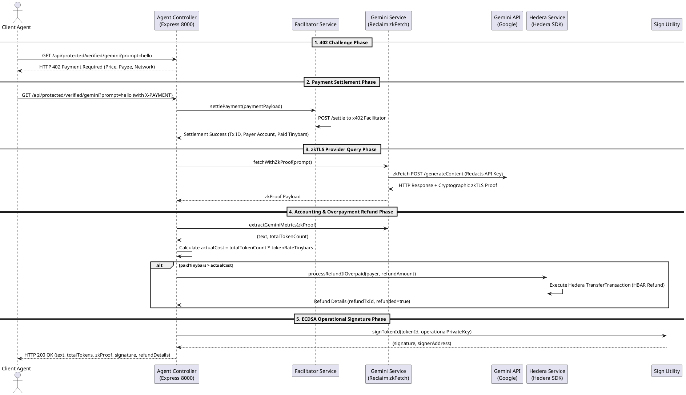

# Server Agent Architecture & Interaction Specification

The **Server Agent** (`server_agent/`) operates as a commercial AI service provider protected by the **x402 Protocol** (HTTP 402 Payment Required). It handles micropayment challenges, settles payments via an x402 facilitator on Hedera Hashgraph, queries upstream LLMs verifiably via Reclaim zkTLS, processes automatic overpayment refunds, and signs operational response tokens.

---

## Core Server Agent Responsibilities

### 1. HTTP 402 Challenge & Facilitator Settlement
- **Challenge Generation**: Upon receiving an HTTP request lacking the `X-PAYMENT` header, `AgentController` sends back an HTTP `402 Payment Required` challenge specifying price per token, payee account, network (`hedera:testnet`), and max timeout.
- **Payment Settlement**: When the client submits an `X-PAYMENT` header containing a base64-encoded signed Hedera transaction, `FacilitatorService` forwards the payload to the x402 facilitator endpoint (`POST /settle`) to execute the HBAR payment on Hedera Testnet.

### 2. On-Chain Registration Scripts (`agen.js`, `reg.js`)
- **Human Registration (`reg.js`)**: Registers the agent operator's wallet on `HumanRegistry.sol`.
- **Agent Identity Minting (`agen.js`)**: Constructs Ethers packed hashes `keccak256(abi.encodePacked(owner, uri, thirdpartyEndpoint))`, signs with the operational private key, and calls `AgentIdentityRegistry.registerAgent()`.

### 3. zkTLS Execution to Third-Party Provider (`gemini.service.js`)
- Uses Reclaim Protocol `zkFetch` to execute HTTPS requests directly to third-party AI APIs (e.g., Google Gemini).
- **Public Options**: Prompt payload text included in public parameters and cryptographically proven.
- **Private Options**: Private headers (`x-goog-api-key`) hidden and redacted from the generated zkTLS proof.

### 4. Overpayment Refund Processing (`hedera.service.js`)
- Extracts `totalTokenCount` from the zkTLS proof response data.
- Computes `actualCostTinybars = totalTokenCount * tokenRateTinybars`.
- Compares total paid tinybars against actual cost:
  $$\text{Refund Tinybars} = \text{Paid Tinybars} - \text{Actual Cost Tinybars}$$
- If overpaid, executes a Hedera SDK `TransferTransaction` returning excess HBAR from the server agent to `payerAccountId`.

### 5. ECDSA Operational Key Signing (`sign.js`)
- Generates an Ethereum-signed message hash (`keccak256(abi.encodePacked(tokenId))`) signed by the agent's registered operational private key.

---

## PlantUML Server Interaction Diagram

