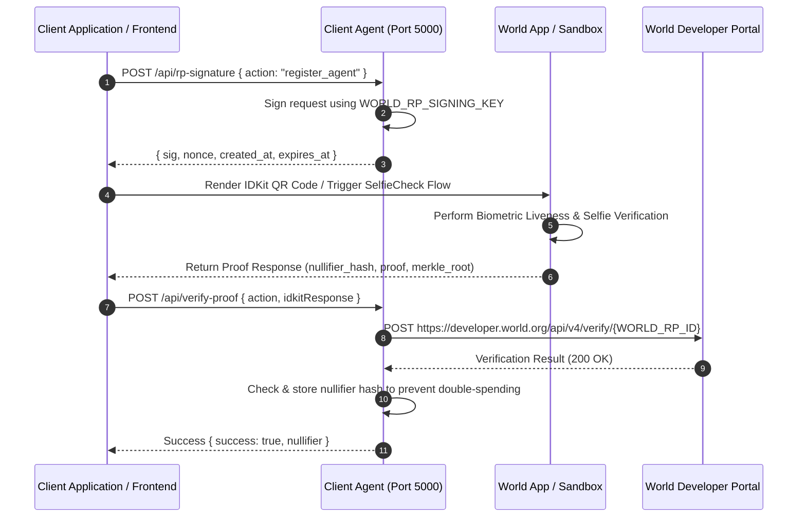

# World ID & SelfieCheck Integration Guide

This document details the integration of **World ID** zero-knowledge proof verification and **SelfieCheck** human verification within the **ProxyProof402** architecture.

---

## 1. Executive Summary & Integration Architecture

ProxyProof402 incorporates World ID to enforce **Sybil resistance** and **risk-based step-up verification** for AI agent operations:

```
+-----------------------------------------------------------------------------------+
|                            ProxyProof402 Verification Rules                       |
|                                                                                   |
|  [Use Case 1] Agent Registration:                                                 |
|  Human Owner  --->  World ID SelfieCheck  --->  HumanRegistry.sol  ---> Mint NFT |
|                                                                                   |
|  [Use Case 2] Execution Step-up Verification:                                     |
|  Unverified Agent  --->  Trust Score Low & No zkTLS?  ---> Prompt World ID        |
|  Query Request           (Reputation < 50)                 SelfieCheck        |
+-----------------------------------------------------------------------------------+
```

### Key Use Cases

1. **Human Ownership Behind AI Agents**:
   - Every AI Agent registered on `AgentIdentityRegistry.sol` must be linked to a verified human identity registered on `HumanRegistry.sol`.
   - World ID SelfieCheck ensures one human cannot mint un-collateralized agent identities continuously (Sybil prevention).

2. **Risk-Based Step-Up Verification**:
   - If a requested service provider agent has a low trust score ($\text{Trust Score} < 50$) on `Reputation.sol` and does **not** provide a verifiable zkTLS proof, the ProxyProof402 Client Agent requires the user to pass a World ID SelfieCheck before completing payment.

---

## 2. SelfieCheck Integration Flow

SelfieCheck provides biometric liveness and face-matching verification via World ID IDKit:



### Backend Endpoint Implementation (`client_agent/src/main.js`)

* **Signature Generation (`/api/rp-signature`)**:
  Generates a cryptographically signed request header using `@worldcoin/idkit-core/signing` and `WORLD_RP_SIGNING_KEY`.
* **Proof Verification (`/api/verify-proof`)**:
  Validates the proof payload against the World Developer Portal API (`https://developer.world.org/api/v4/verify/${WORLD_RP_ID}`) and maintains an in-memory nullifier store to prevent duplicate verifications per action.

---

## 3. Developer Portal Guidance & Product Discovery

### 3.1 Setup & Configuration
1. **Access Developer Portal**: Navigate to [developer.world.org](https://developer.world.org).
2. **App Creation**: Create an app under the project workspace to obtain your **RP App ID** (`rp_...`) and **RP Signing Key**.
3. **Actions Configuration**: Define target verification actions (e.g., `register_agent`, `high_risk_execution`). Set verification level requirements (`orb`, `device`, or `selfie_check`).

### 3.2 Key Production & Debugging Checklist
- Ensure `WORLD_RP_ID` matches your App ID (`rp_...`) in environment variables.
- Ensure the `action` string passed to `/api/rp-signature` matches the action defined in the Developer Portal.
- Monitor response status codes:
  - `400 Bad Request`: Mismatched action string, invalid payload structure, or expired nonce.
  - `409 Conflict`: Duplicate nullifier hash detected (user has already verified for this action).
  - `502 Bad Gateway`: Upstream Developer Portal connectivity issue.

---

## 4. Sandbox App States, Test Flows & Edge Cases

### 4.1 Testing Workflow with World App Simulator / Sandbox
- Use the **World App Sandbox** app to simulate proof generation without needing an Orb or live biometric scan.
- Configure test personas within the Sandbox environment to emulate different verification levels:
  - `Orb-verified`: High trust score persona.
  - `Device-verified`: Medium trust score persona.
  - `SelfieCheck-verified`: Biometric liveness verified persona.

### 4.2 Handling Edge Cases
- **Nullifier Reuse**: Re-verifying the same user for the same action must return a `409 Conflict` error to prevent Sybil exploits.
- **Verification Expiration**: Signatures include `expires_at` timestamps. Expired signatures must be rejected by the backend.
- **Network Failures**: Gracefully fall back to standard zkTLS requirements if the World ID verification endpoint is unreachable.

---

## 5. Developer Feedback & Friction Points

During the integration and testing phase of World ID and SelfieCheck in ProxyProof402, the following developer friction points were encountered:

### 1. Sandbox QR Code Scanning Limitation
- **Issue**: The World App Sandbox application lacked a direct built-in QR code scanner (unlike the production World App).
- **Workaround**: Developers had to scan generated QR codes using **Google Lens** or standard camera utilities to extract the deep link URI and trigger the Sandbox app launch.
- **Recommendation**: Integrate an inline QR reader directly within the Sandbox mobile application interface.

### 2. Intermittent Mobile App Stability (Initial Registration)
- **Issue**: During the initial SelfieCheck camera capture step in the Sandbox test app, the mobile application experienced occasional random crashes during liveness frame processing.
- **Workaround**: Re-launching the app and re-initiating the verification session resolved the state.
- **Recommendation**: Improve crash telemetry and error reporting during camera/frame initialization in Sandbox builds.

### 3. Verification Level Documentation Clariy
- **Issue**: Distinguishing programmatically between standard Device verification and explicit SelfieCheck requirements in initial IDKit SDK releases required additional trial and error.
- **Recommendation**: Provide explicit code snippets for enforcing minimum verification thresholds (`VerificationLevel.Orb` vs `VerificationLevel.Device`) in backend validation guides.
